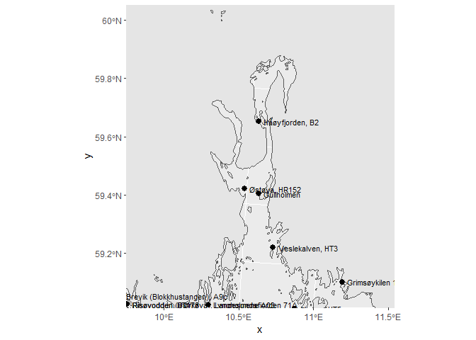
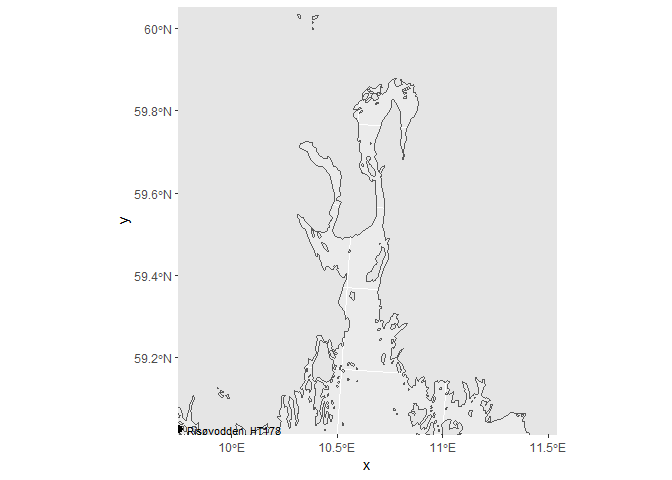

For å se om det virkelig ikke er data for Indre Oslofjord. Se mail til/fra Hege 16.08.2019.  


```r
library(sf)
```

```
## Linking to GEOS 3.6.1, GDAL 2.2.3, PROJ 4.9.3
```

```r
library(readxl)
library(ggplot2)
library(dplyr)
```

```
## 
## Attaching package: 'dplyr'
```

```
## The following objects are masked from 'package:stats':
## 
##     filter, lag
```

```
## The following objects are masked from 'package:base':
## 
##     intersect, setdiff, setequal, union
```

## Filer

```r
dir("Input_data", "Vannmil*")
```

```
## [1] "VannmiljoEksport_2019-05-27_havforsuring.xlsx"             
## [2] "VannmiljoEksport_2019-05-27_indre_ytre_oslofjord.xlsx"     
## [3] "VannmiljoEksport_2019-05-27_indre_ytre_oslofjord_step1.jpg"
## [4] "VannmiljoEksport_2019-05-27_indre_ytre_oslofjord_step2.jpg"
## [5] "VannmiljoEksport_2019-05-27_okokyst.JPG"                   
## [6] "VannmiljoEksport_2019-05-27_okokyst.xlsx"                  
## [7] "VannmiljoEksport_vannreg.xlsx"                             
## [8] "Vannmiljø MSMDI samtlige.xlsx"                             
## [9] "Vannmiljø Multimetrisk indeks (RSL(A) 1 -5 ) samtlige.xlsx"
```


## MSMDI  
Filer fra Vannmiljø - søkte kun på parameter (MSMDI1, MSMDI2, MSMD3), ikke på "forvaltningsaktivitet e.l."  

```r
fn <-  "Input_data/Vannmiljø MSMDI samtlige.xlsx"
df <- read_excel(fn)
df_stations <- df %>%
  rename(x = `UTM33 Ost (X)`, y = `UTM33 Nord (Y)`) %>%
  count(Vannlokalitet, x, y)

# Norway (coastline) in UTM coordinates
nc_norway <- st_read("K:/Kart/N1000/norge2.shp")
```

```
## Reading layer `norge2' from data source `K:\Kart\N1000\norge2.shp' using driver `ESRI Shapefile'
## Simple feature collection with 2030 features and 4 fields
## geometry type:  POLYGON
## dimension:      XY
## bbox:           xmin: -75844 ymin: 6449504 xmax: 1114610 ymax: 7939790
## epsg (SRID):    NA
## proj4string:    NA
```

```r
st_crs(nc_norway) <- "+proj=utm +zone=33"  # set coordinate system

# ggplot(nc_norway) + geom_sf() +
#   coord_sf(xlim = c(198700, 301600), ylim = c(6553200, 6669600), expand = FALSE)

# Stations as sf (not really necessary, as they are in the same projection as the base map)
sf_stations <- st_as_sf(df_stations, coords = c("x", "y"), crs = "+proj=utm +zone=33")

ggplot(nc_norway) + geom_sf() +
  geom_sf(data = sf_stations, size = 4, shape = 20) +
  geom_sf_text(data = sf_stations, aes(label = Vannlokalitet), size = 3, hjust = 0, nudge_x = 2000) +
  coord_sf(xlim = c(198700, 301600), ylim = c(6553200, 6669600), expand = FALSE)
```

<!-- -->

## RSL   
Fil fra Vannmiljø - søkte kun på parameter (RSLA1, RSLA2, RSLA3, RSL4, RSL5)  

```r
fn <- "Input_data/Vannmiljø Multimetrisk indeks (RSL(A) 1 -5 ) samtlige.xlsx"

df <- read_excel(fn)
df_stations <- df %>%
  rename(x = `UTM33 Ost (X)`, y = `UTM33 Nord (Y)`) %>%
  count(Vannlokalitet, x, y)

# Norway (coastline) in UTM coordinates
nc_norway <- st_read("K:/Kart/N1000/norge2.shp")
```

```
## Reading layer `norge2' from data source `K:\Kart\N1000\norge2.shp' using driver `ESRI Shapefile'
## Simple feature collection with 2030 features and 4 fields
## geometry type:  POLYGON
## dimension:      XY
## bbox:           xmin: -75844 ymin: 6449504 xmax: 1114610 ymax: 7939790
## epsg (SRID):    NA
## proj4string:    NA
```

```r
st_crs(nc_norway) <- "+proj=utm +zone=33"  # set coordinate system

# ggplot(nc_norway) + geom_sf() +
#   coord_sf(xlim = c(198700, 301600), ylim = c(6553200, 6669600), expand = FALSE)

# Stations as sf (not really necessary, as they are in the same projection as the base map)
sf_stations <- st_as_sf(df_stations, coords = c("x", "y"), crs = "+proj=utm +zone=33")

ggplot(nc_norway) + geom_sf() +
  geom_sf(data = sf_stations, size = 4, shape = 20) +
  geom_sf_text(data = sf_stations, aes(label = Vannlokalitet), size = 3, hjust = 0, nudge_x = 2000) +
  coord_sf(xlim = c(198700, 301600), ylim = c(6553200, 6669600), expand = FALSE)
```

<!-- -->
