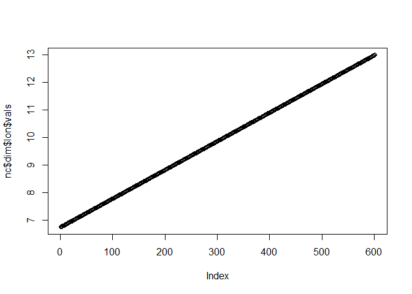
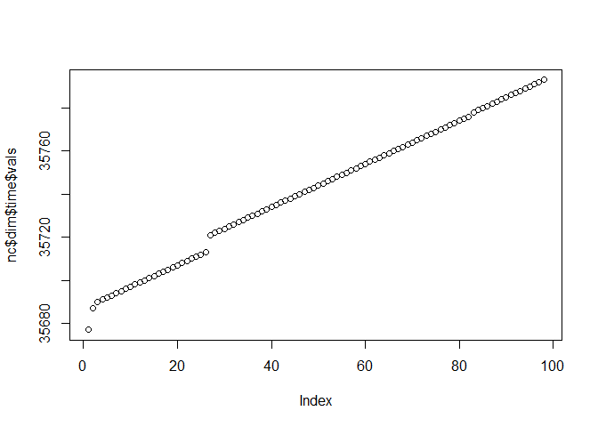
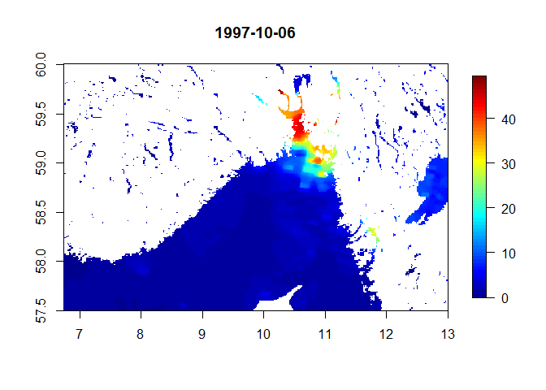

## Library

```r
library(ncdf4)
```

## Pick file  
Daily L4 Chl a concentration  

```r
fns <- dir("Input_data", ".nc")
fn <- fns[2]
fn
```

```
## [1] "dataset-oc-atl-chl-multi-l4-oi_1km_daily-rep-v02_1997.nc"
```

## Explore file

```r
# ?ncdf4::ncvar_get

nc <- nc_open(paste0("Input_data/", fn))
nc$nvars
```

```
## [1] 2
```

```r
str(nc$var, 1)
```

```
## List of 2
##  $ CHL      :List of 22
##   ..- attr(*, "class")= chr "ncvar4"
##  $ CHL_error:List of 23
##   ..- attr(*, "class")= chr "ncvar4"
```

```r
str(nc$dim, 1)
```

```
## List of 3
##  $ time:List of 11
##   ..- attr(*, "class")= chr "ncdim4"
##  $ lat :List of 10
##   ..- attr(*, "class")= chr "ncdim4"
##  $ lon :List of 10
##   ..- attr(*, "class")= chr "ncdim4"
```

```r
str(nc$dim, 2)
```

```
## List of 3
##  $ time:List of 11
##   ..$ name         : chr "time"
##   ..$ len          : int 98
##   ..$ unlim        : logi FALSE
##   ..$ group_index  : int 1
##   ..$ group_id     : int 65536
##   ..$ id           : int 0
##   ..$ dimvarid     :List of 5
##   .. ..- attr(*, "class")= chr "ncid4"
##   ..$ units        : chr "days since 1900-01-01 00:00:00"
##   ..$ calendar     : chr "Gregorian"
##   ..$ vals         : num [1:98(1d)] 35677 35687 35690 35691 35692 ...
##   ..$ create_dimvar: logi TRUE
##   ..- attr(*, "class")= chr "ncdim4"
##  $ lat :List of 10
##   ..$ name         : chr "lat"
##   ..$ len          : int 241
##   ..$ unlim        : logi FALSE
##   ..$ group_index  : int 1
##   ..$ group_id     : int 65536
##   ..$ id           : int 1
##   ..$ dimvarid     :List of 5
##   .. ..- attr(*, "class")= chr "ncid4"
##   ..$ units        : chr "degrees_north"
##   ..$ vals         : num [1:241(1d)] 60 60 60 60 60 ...
##   ..$ create_dimvar: logi TRUE
##   ..- attr(*, "class")= chr "ncdim4"
##  $ lon :List of 10
##   ..$ name         : chr "lon"
##   ..$ len          : int 601
##   ..$ unlim        : logi FALSE
##   ..$ group_index  : int 1
##   ..$ group_id     : int 65536
##   ..$ id           : int 2
##   ..$ dimvarid     :List of 5
##   .. ..- attr(*, "class")= chr "ncid4"
##   ..$ units        : chr "degrees_east"
##   ..$ vals         : num [1:601(1d)] 6.74 6.76 6.77 6.78 6.79 ...
##   ..$ create_dimvar: logi TRUE
##   ..- attr(*, "class")= chr "ncdim4"
```

```r
# plot(nc$dim$lat$vals)
 plot(nc$dim$lon$vals)
```

<!-- -->

```r
plot(nc$dim$time$vals)
```

<!-- -->

## Read data

```r
x <- ncvar_get(nc, "CHL")  # reads all 
dim(x)
```

```
## [1] 601 241  98
```

## Plot map for a given day

```r
# Time step number
i <- 20

# Time in R format 
time <- as.POSIXct(nc$dim$time$vals[i]*86400, origin = "1900-01-01", tz = "GMT")

x_day <- list(
  x = nc$dim$lon$vals,
  y = rev(nc$dim$lat$vals),
  z = x[,,i][,seq(dim(x)[2],1)]
)

fields::image.plot(x_day, main = time)
```

<!-- -->


