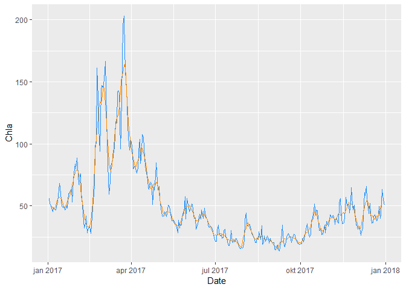

# Reading from met.no's thredds server using Python chunks  

The Python code is based on Ann-Kristin's Python examples:   
https://github.com/annks/Examples  
  
See Ann-Kristin's notebook  
https://nbviewer.jupyter.org/github/annks/Examples/blob/master/MartiniControlRun.ipynb  
for more explanation of the Python parts  


## R libraries
Note that we have to use "use_python" because we did not install Python as Admin

```r
# install.packages("reticulate")
library(reticulate)
use_python("C:/WinPython/WPy64-3720/python-3.7.2.amd64/python.exe")   # my Python installation

library(ggplot2)
```

```
## Registered S3 methods overwritten by 'ggplot2':
##   method         from 
##   [.quosures     rlang
##   c.quosures     rlang
##   print.quosures rlang
```

```r
library(lubridate)
```

```
## 
## Attaching package: 'lubridate'
```

```
## The following object is masked from 'package:base':
## 
##     date
```

```r
library(dplyr)
```

```
## 
## Attaching package: 'dplyr'
```

```
## The following objects are masked from 'package:lubridate':
## 
##     intersect, setdiff, union
```

```
## The following objects are masked from 'package:stats':
## 
##     filter, lag
```

```
## The following objects are masked from 'package:base':
## 
##     intersect, setdiff, setequal, union
```


## Python parts

### Connect to thredds server  

```python
import numpy as np    # Package for scientific computing 
import matplotlib.pyplot as plt   
from datetime import datetime,timedelta

from netCDF4 import Dataset #  This is handy for working with netCDF files

import cartopy.crs as ccrs
import cartopy.feature as cfeature

import roppy

filepath = 'http://thredds.met.no/thredds/dodsC/metusers/arildb/MARTINI800_prov_v2.ncml' # The OPENDAP URL

filehandle = Dataset(filepath) # open for reading 
grid = roppy.SGrid(filehandle) # Create a grid object for our file
```


### Access variables and dimensions    

```python
# Access to the longitude, latitude coordinates
lon = filehandle.variables['lon_rho']
lat = filehandle.variables['lat_rho']

# Access to the chlorophyll A variable
chla = filehandle.variables['P1_Chl']

# Let's see what the dimensions of this variable is by looping over the dimensions
for dimension in chla.dimensions:
    # We'll print both dimension name, and the size of th dimension
    print('{}: {}'.format( dimension,  len(filehandle.dimensions[dimension] ) ) )
```

```
## ocean_time: 364
## s_rho: 42
## eta_rho: 426
## xi_rho: 480
```

```python
print('\n') # Ensure a blank line between chla and longitude dimensions

# And lets look at longitude as well:
```

```python
for dimension in lon.dimensions:
    # We'll print both dimension name, and the size of th dimension
    print( '{}: {}'.format( dimension,  len( filehandle.dimensions[dimension] ) ) )
```

```
## eta_rho: 426
## xi_rho: 480
```

### Find grid cell closest to Torbjørnsskjær  
_NOTE_: Avoid norwegian letters in the Python code, even in the comments - it causes errors (there is probably a way to fix this)  

```python
# The decimal degree location of the Torbjornskjaer station:
torbjornskjar_lon = 10.6653
torbjornskjar_lat = 59.0361

# We need to find the grid location closest to Torbjornskjaer.
# For the sake of simplicity, let's calculate the sum of the absolute 
# differences between all grid points latitude and longitude and the 
# Torbjornskjaer coordinates. 

position_diff = np.abs( lat[:] - torbjornskjar_lat ) + np.abs( lon[:] - torbjornskjar_lon )

# This line will find the indices of the minimum value in 
i, j = np.unravel_index( position_diff.argmin(), position_diff.shape )

print('Grid indices of grid point closest to Torbjornskjaer: {}, {}\n'.format(i, j))
```

```
## Grid indices of grid point closest to Torbjornskjaer: 201, 367
```

```python
print('Grid point longitude: {}'.format(lon[i,j]))
```

```
## Grid point longitude: 10.668787924052388
```

```python
print('Grid point latitude: {}'.format(lat[i,j]))
```

```
## Grid point latitude: 59.03713575538488
```

### Get the thickness of each depth level at Torbjørnsskjær  

```python
dZ = grid.z_w[1:, i,j] - grid.z_w[:-1, i, j]  
print(dZ)
```

```
## [3.988591965482385 4.8908167134702865 5.5604924592933 6.036866186195184
##  6.353270009091403 6.537972730060005 6.614912687002615 6.604328044199917
##  6.523298517856901 6.386210657456104 6.205157178032607 5.9902794272981765
##  5.750060846946269 5.491578225122922 5.220716615761617 4.942353001786458
##  4.660513087017982 4.378505001981942 4.099033189542972 3.824295286773591
##  3.556064430508677 3.2957590776159584 3.044502140167033 2.8031709843712207
##  2.572439625075056 2.3528142602692377 2.1446631284179922
##  1.9482415320940945 1.7637127513840838 1.591165467239282
##  1.4306282261510166 1.2820814012873205 1.1454670398728855
##  1.0206969306793443 0.9076591777807179 0.8062235261495667
##  0.7162456503140717 0.6375705883860057 0.570035479647816
##  0.5134717440028075 0.4677068254882294 0.4325656093558712]
```

### Get reference time  
This we actually don't need to do in Python, we can do this in R also   

```python
# Get time variable from file 
ocean_time = filehandle.variables['ocean_time']
# The time on a netCDF file is usually specified as seconds/days/hours since a reference date
# This should be specified in the units attribute:
print('Units of ocean_time: {}\n'.format(ocean_time.units))

# The python package datetime is convenient for handling conversion from the numbers in ocean_time
# to actual dates, and back again.
```

```
## Units of ocean_time: seconds since 1970-01-01 00:00:00
```

```python
expected_format = 'seconds since %Y-%m-%d %H:%M:%S'
timeref = datetime.strptime(ocean_time.units, expected_format) # Creating a datetime object for the reference time

print(timeref)
```

```
## 1970-01-01 00:00:00
```

### Get dates (as datetime object)

```python
ocean_time = filehandle.variables['ocean_time'][:]
# Let's see what first and last timestamp on the file is:
print('First timestamp on file: {}'.format( timeref + timedelta(seconds = ocean_time[0] ) ))
```

```
## First timestamp on file: 2017-01-02 00:00:00
```

```python
print('Second timestamp on file: {}'.format( timeref + timedelta(seconds = ocean_time[1] ) ))
```

```
## Second timestamp on file: 2017-01-03 00:00:00
```

```python
print('Third timestamp on file: {}'.format( timeref + timedelta(seconds = ocean_time[2] ) ))
```

```
## Third timestamp on file: 2017-01-04 00:00:00
```

```python
print('Second to last timestamp on file: {}'.format( timeref + timedelta(seconds = ocean_time[-2] )) )
```

```
## Second to last timestamp on file: 2017-12-30 00:00:00
```

```python
print('Last timestamp on file: {}'.format( timeref + timedelta(seconds = ocean_time[-1] ) ))

# make new time variable that contains datetime objects:
```

```
## Last timestamp on file: 2017-12-31 00:00:00
```

```python
dates = np.array([ timeref + timedelta(seconds=t) for t in ocean_time  ])

```

### get Chl a by integrating Chl a over the water column  
Also makes a running weekly average  

```python
# To get the concentration in the whole water column,  
# we calculate the sum of all vertical grid cells 
# the axis = 1 argument in the function call below means we sum over the z-axis  
# Remember, the dimensions are in (t,z,y,x) order and as indexing in Python starts from zero, 
# axis = 1 points to the z-dimension. 

chla_at_torbjornskjar = np.sum( chla[:,:,i,j] * dZ, axis = 1)  # Leaves us with a timeseries with unit mg/m2 

# We can also make a smoother timeseries, with e.g. weekly means

# Make a running weekly average (we saw abobe that the file holds daily values)
mean_chla = np.array([ np.mean(chla_at_torbjornskjar[n:n+7]) for n in range(len(chla_at_torbjornskjar) -7) ])

# Calculate the mean of the timestamps in a similar manner
mean_time =  np.array([ np.mean(ocean_time[n:n+7]) for n in range(len(chla_at_torbjornskjar) -7) ]) # this is in seconds since reftime
mean_time = np.array([ timeref + timedelta(seconds=t) for t in mean_time ]) # this is datetime objects
```

### Plot in Python  
* Note that we need to add `plt.show()` in order to actually show the plot (in Jupyter, you don't need that)   

```python

# A simple plot of the timeseries:
plt.figure(figsize=(12,5))
plt.plot(dates, chla_at_torbjornskjar, color = 'cornflowerblue', label = 'daily') # our dates array is used as x-axis

# Add axis labels. 
plt.ylabel('$mg/m^2$', fontsize = 16);  
plt.xlabel('Date', fontsize = 16);

# Make a running weekly average (we saw abobe that the file holds daily values)
mean_chla = np.array([ np.mean(chla_at_torbjornskjar[n:n+7]) for n in range(len(chla_at_torbjornskjar) -7) ])

# Calculate the mean of the timestamps in a similar manner
mean_time =  np.array([ np.mean(ocean_time[n:n+7]) for n in range(len(chla_at_torbjornskjar) -7) ]) # this is in seconds since reftime
mean_time = np.array([ timeref + timedelta(seconds=t) for t in mean_time ]) # this is datetime objects

plt.plot(mean_time, mean_chla, color = 'orange', label = 'weekly')

plt.legend(loc='upper right');
plt.title('Time evolution of Chlorophyll A at Torbjornskjaer', fontsize = 'x-large');

plt.show()
```


## Bring data into R  

* The data generated in Python (here, 'ocean_time' and 'chla_at_torbjornskjar') can be accessed in R by putting `py$` in front of them  


### Same plot (more or less) in R base plot  
We here use running medians (runmed) instead of a running mean  

```r
date <- as.POSIXct(py$ocean_time, origin = "1970-01-01", tz = "UTC")
plot(date, py$chla_at_torbjornskjar, type = "l", col = "dodgerblue")

# Calculate running medians (not mean, for a change)
mean_date <- runmed(date, 7)
mean_chla <- runmed(py$chla_at_torbjornskjar, 7)
lines(mean_date, mean_chla, type = "l", col = "darkorange")
```

<!-- -->


### Same plot in R ggplot  
Calculating running mean 'on the fly within' ggplot  

```r
library(zoo)
```

```
## 
## Attaching package: 'zoo'
```

```
## The following objects are masked from 'package:base':
## 
##     as.Date, as.Date.numeric
```

```r
df <- tibble(
  Date = as.POSIXct(py$ocean_time, origin = "1970-01-01", tz = "UTC"),
  Chla = py$chla_at_torbjornskjar)

ggplot(df, aes(Date, Chla)) +
  geom_line(color = "dodgerblue")  + 
  geom_line(aes(y = rollmean(Chla, 7, na.pad=TRUE)), color = "darkorange") 
```

```
## Warning: Removed 6 rows containing missing values (geom_path).
```

<!-- -->
