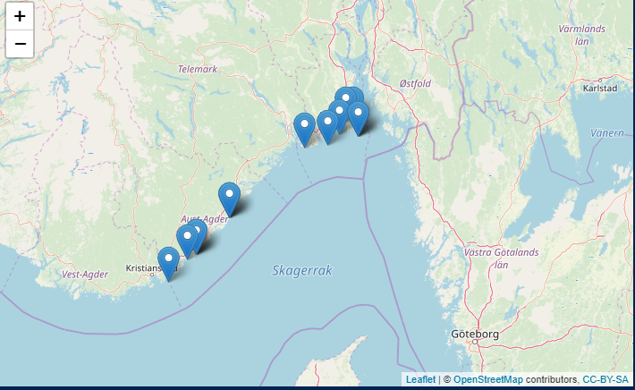
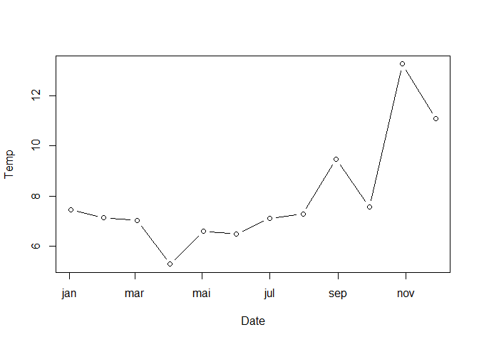
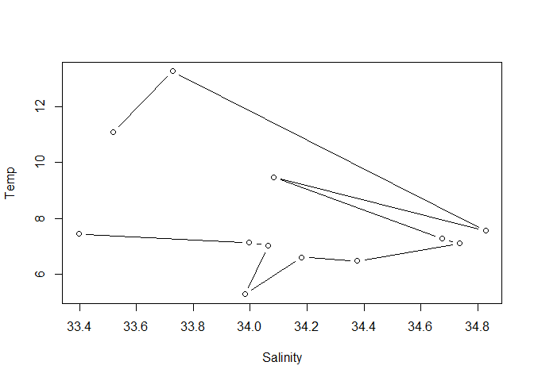
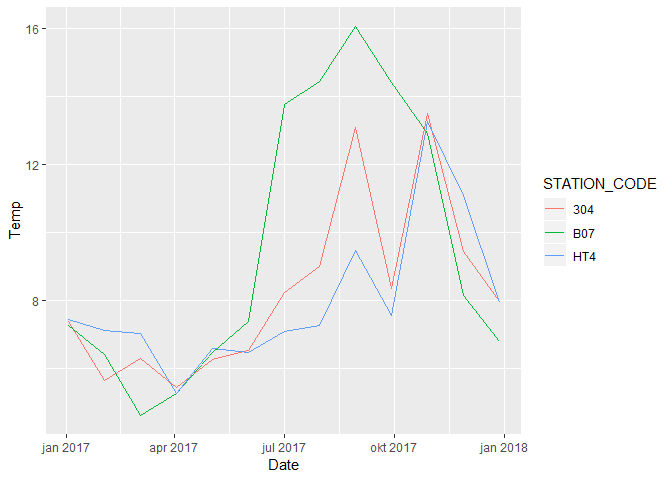
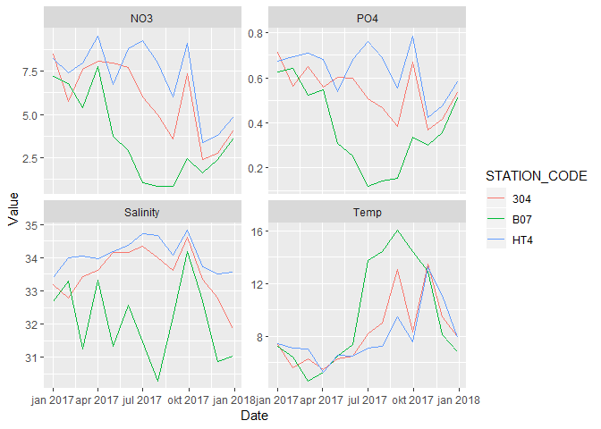

# Reading from met.no's thredds server using Python chunks  

Results from met.no's oceanographic models are stored as huge NetCDF files in the `ncml` format. Those files are too big for downloading; instead one reads just the part of the data that you are interested in. The usual R library for the NetCDF format (`ncdf4`) can read `.nc` files, but not the `ncml` format. A new R libarry called `LoadeR` (that I know of) _can_ read `ncml` files, but was found to not handle the particular format used in the oceanographic model results.   
  
However, Python has good tools for this. Fortunately, calling Python from R is pretty easy, and has gotten very elegant using the reticulate package. In this markdown document we use code chunks of two types, R code chunks and Python code chunks.         

The Python code inside the Python chunks are based on Python examples from a Jupyter notebook by  
Ann-Kristin Sperrevik, see 
* https://nbviewer.jupyter.org/github/annks/Examples/blob/master/MartiniControlRun.ipynb    
and   
* https://github.com/annks/Examples  
See Ann-Kristin's notebook for more explanation of the Python parts.    


## 1. R part

### a. Libraries

```r
library(reticulate)
use_python("C:/WinPython/WPy64-3720/python-3.7.2.amd64/python.exe")   # my Python installation

library(readxl)
library(ggplot2)
library(lubridate)
library(dplyr)
library(purrr)
```


### b. Get raw data and locations
* Read hard-bottom data, `data_hardbottom`  
* Then we extract location of the most used stations, `data_loc`  
    - We use count() to get one line per station  
    - count() automatocally adds the variable n for sample size  
    - We then use n to get only stations with >= 500 lines of data  
    

```r
data_hardbottom <- read_excel("Test_data/data_hardbottom.xlsx")

data_stations <- data_hardbottom %>%
  count(STATION_CODE, STATION_NAME, LONGITUDE, LATITUDE) %>%
  filter(n > 500)
```

### c. Plot stations in leaflet

```r
library(leaflet)

leaflet() %>%
  addTiles() %>%
  addMarkers(lng = data_stations$LONGITUDE, lat = data_stations$LATITUDE,
             popup = paste(data_stations$STATION_CODE, data_stations$STATION_NAME))
```



### d. Select one location     
Færder fyr  
* Note: this returns a one-row dat frame

```r
selected_location <- data_stations %>%
  filter(STATION_CODE == "HT4")

selected_location
```

```
## # A tibble: 1 x 5
##   STATION_CODE STATION_NAME LONGITUDE LATITUDE     n
##   <chr>        <chr>            <dbl>    <dbl> <int>
## 1 HT4          Færder fyr        10.5     59.0  2200
```

## 2. Python part

* Python code is put inside code chunks marked 'python' instead of 'R'
* Note that you have to avoid Norwegian letters in the Python code, even in the comments - it causes errors (there is probably a way to fix this)  

### a. Connect to thredds server  

```python
import numpy as np     # Package for scientific computing 
import pandas as pd    # Package for data frames 
import matplotlib.pyplot as plt   
from datetime import datetime,timedelta

from netCDF4 import Dataset #  This is handy for working with netCDF files

import cartopy.crs as ccrs
import cartopy.feature as cfeature

import roppy

filepath = 'http://thredds.met.no/thredds/dodsC/metusers/arildb/MARTINI800_prov_v2.ncml' # The OPENDAP URL

filehandle = Dataset(filepath) # open for reading 
grid = roppy.SGrid(filehandle) # Create a grid object for our file
```

### b. List all variables  
Lots to choose from!  

```python
print(filehandle.variables.keys())
```

```
## odict_keys(['ntimes', 'ndtfast', 'dt', 'dtfast', 'dstart', 'shuffle', 'deflate', 'deflate_level', 'nHIS', 'ndefHIS', 'nRST', 'ntsAVG', 'nAVG', 'ndefAVG', 'ntsDIA', 'nDIA', 'ndefDIA', 'nSTA', 'Falpha', 'Fbeta', 'Fgamma', 'nl_tnu2', 'nl_visc2', 'LuvSponge', 'LtracerSponge', 'Akt_bak', 'Akv_bak', 'Akk_bak', 'Akp_bak', 'rdrg', 'rdrg2', 'Zob', 'Zos', 'gls_p', 'gls_m', 'gls_n', 'gls_cmu0', 'gls_c1', 'gls_c2', 'gls_c3m', 'gls_c3p', 'gls_sigk', 'gls_sigp', 'gls_Kmin', 'gls_Pmin', 'Charnok_alpha', 'Zos_hsig_alpha', 'sz_alpha', 'CrgBan_cw', 'Znudg', 'M2nudg', 'M3nudg', 'Tnudg', 'Tnudg_SSS', 'FSobc_in', 'FSobc_out', 'M2obc_in', 'M2obc_out', 'Tobc_in', 'Tobc_out', 'M3obc_in', 'M3obc_out', 'rho0', 'gamma2', 'LuvSrc', 'LwSrc', 'LtracerSrc', 'LsshCLM', 'Lm2CLM', 'Lm3CLM', 'LtracerCLM', 'LnudgeM2CLM', 'LnudgeM3CLM', 'LnudgeTCLM', 'spherical', 'xl', 'el', 'Vtransform', 'Vstretching', 'theta_s', 'theta_b', 'Tcline', 'hc', 's_rho', 's_w', 'Cs_r', 'Cs_w', 'h', 'f', 'pm', 'pn', 'lon_rho', 'lat_rho', 'lon_u', 'lat_u', 'lon_v', 'lat_v', 'lon_psi', 'lat_psi', 'angle', 'mask_rho', 'mask_u', 'mask_v', 'mask_psi', 'ocean_time', 'zeta', 'ubar', 'vbar', 'u', 'v', 'w', 'omega', 'temp', 'salt', 'N1_p', 'N3_n', 'N4_n', 'N5_s', 'O2_o', 'O3_c', 'O3_TA', 'NR1_c', 'NR1_n', 'NR1_p', 'CR1_c', 'CR1_n', 'CR1_p', 'NR2_c', 'CR2_c', 'NR3_c', 'CR3_c', 'R4_c', 'R4_n', 'R4_p', 'R6_c', 'R6_n', 'R6_p', 'R6_s', 'R8_c', 'R8_n', 'R8_p', 'R8_s', 'P1_c', 'P1_n', 'P1_p', 'P1_Chl', 'P1_s', 'P2_c', 'P2_n', 'P2_p', 'P2_Chl', 'P3_c', 'P3_n', 'P3_p', 'P3_Chl', 'P4_c', 'P4_n', 'P4_p', 'P4_Chl', 'L2_c', 'P5_c', 'P5_n', 'P5_p', 'P5_Chl', 'P6_c', 'P6_n', 'P6_p', 'P6_Chl', 'B1_c', 'B1_n', 'B1_p', 'Z4_c', 'Z5_c', 'Z5_n', 'Z5_p', 'Z6_c', 'Z6_n', 'Z6_p', 'rho', 'AKv', 'AKs', 'shflux', 'ssflux', 'latent', 'sensible', 'lwrad', 'evaporation', 'rain', 'swrad', 'swradWm2', 'xCO2atm', 'pCO2atm', 'Q1_c', 'Q1_p', 'Q1_n', 'H1_c', 'ben_col_D1m', 'ben_col_D2m', 'H2_c', 'Y4_c', 'Y3_c', 'Y2_c', 'Q6_c', 'Q6_p', 'Q6_n', 'Q6_s', 'Q6_pen_depth_c', 'Q6_pen_depth_n', 'Q6_pen_depth_p', 'Q6_pen_depth_s', 'Q7_c', 'Q7_p', 'Q7_n', 'Q7_pen_depth_c', 'Q7_pen_depth_n', 'Q7_pen_depth_p', 'Q17_c', 'Q17_p', 'Q17_n', 'bL2_c', 'K1_p', 'ben_nit_G4n', 'K3_n', 'K4_n', 'K5_s', 'G2_o', 'G2_o_deep', 'G3_c'])
```

### c. Get info on one variable

```python
filehandle.variables['P3_Chl']
```

```
## <class 'netCDF4._netCDF4.Variable'>
## float32 P3_Chl(ocean_time, s_rho, eta_rho, xi_rho)
##     long_name: picophytoplankton/chlorophyll a
##     units: mg/m^3
##     time: ocean_time
##     coordinates: lon_rho lat_rho s_rho ocean_time
##     field: P3_Chl, scalar, series
##     _FillValue: 1e+37
##     _ChunkSizes: [  1  14 142 160]
## unlimited dimensions: 
## current shape = (364, 42, 426, 480)
## filling off
```

### d. Get all variables' long names  
Note: commented out, as it generates a very long list  

```python
keys = filehandle.variables.keys()
print('Number of variables:', len(keys))
```

```
## Number of variables: 228
```

```python
print()

# for key in keys:
#   print(key, '=', filehandle.variables[key].long_name)
```


### e. Access longitude, latitude and time  and dimensions    
* This doesn't actually download the data, it just creates a 'pointer' to them  

```python
# Access to the longitude, latitude coordinates

lon = filehandle.variables['lon_rho']
lat = filehandle.variables['lat_rho']
ocean_time = filehandle.variables['ocean_time']
```

### f. Explore dimensions 

```python
# Let's see what the dimensions of this variable is by looping over the dimensions
print('Time dimensions:')
```

```
## Time dimensions:
```

```python
for dimension in ocean_time.dimensions:
    # We'll print both dimension name, and the size of th dimension
    print('{}: {}'.format( dimension,  len(filehandle.dimensions[dimension] ) ) )

# And lets look at longitude as well:
```

```
## ocean_time: 364
```

```python
print('\nLongitude (or latitude) dimensions:')   # \n is just "line shift"
```

```
## 
## Longitude (or latitude) dimensions:
```

```python
for dimension in lon.dimensions:
    print( '{}: {}'.format( dimension,  len( filehandle.dimensions[dimension] ) ) )

# And finally let's look at one 'ordinary' variable:
```

```
## eta_rho: 426
## xi_rho: 480
```

```python
print('\nDimensions of the temperature variable:')
```

```
## 
## Dimensions of the temperature variable:
```

```python
temp = filehandle.variables['temp']
for dimension in temp.dimensions:
    print( '{}: {}'.format( dimension,  len( filehandle.dimensions[dimension] ) ) )
```

```
## ocean_time: 364
## s_rho: 42
## eta_rho: 426
## xi_rho: 480
```


### g. Find grid cell closest to our chosen station in R      
* Inside a Python chunk, we can access an R Object (values, vectors, dataframes) by putting `r.` in front of the objects name  
    - E.g., we access R object `selected_location` by `r.selected_location`  
* R data frames are converted to a Pandas DataFrame in Python   
* In a Pandas DataFrame, you access a value by ['column_name'][row_number]  
* Here we will access the R data frame `selected_location` (which has only one line)
* We need to access longitude number 1 and latitude number 1 of this data frame -
but be aware that Python starts counting at zero
* So to get the first Longitude value, we write  
    - R version 1: selected_location[1, 'LONGITUDE'] - OR  
    - R version 2: selected_location$LONGITUDE[1]  
    - Python: r.selected_location['LONGITUDE'][0]  


```python
# The decimal degree location of the selected station:
selected_lon = r.selected_location['LONGITUDE'][0]
selected_lat = r.selected_location['LATITUDE'][0]

# We need to find the grid location closest to the selected coordinates.
# For the sake of simplicity, let's calculate the sum of the absolute 
# differences between all grid points latitude and longitude and the 
# selected coordinates. 

position_diff = np.abs( lat[:] - selected_lat ) + np.abs( lon[:] - selected_lon )

# This line will find the indices of the minimum value in 
i, j = np.unravel_index( position_diff.argmin(), position_diff.shape )

print('Grid indices of grid point closest to selected location: {}, {}\n'.format(i, j))
```

```
## Grid indices of grid point closest to selected location: 209, 360
```

```python
print('Grid point longitude: {}'.format(lon[i,j]))
```

```
## Grid point longitude: 10.523888043689027
```

```python
print('Grid point latitude: {}'.format(lat[i,j]))
```

```
## Grid point latitude: 59.02317070046719
```


### h. Getting surface values    

```python
# The dimensions are in (t,z,y,x) order and as indexi,g in Python starts from zero, 
# axis = 1 points to the z-dimension. 

times = np.arange(0,360,30) 

# temp = potential temperaturen
# salt = salinity
# N1_p = phosphate/phosphorus
# N3_n = nitrate/nitrogen
# chla = chlorophyll A
data_loc = pd.DataFrame({
  'Station': r.selected_location['STATION_CODE'][0],  
  'i': i,
  'j': j,
  'Time_num': filehandle.variables['ocean_time'][times],
  'Temp': filehandle.variables['temp'][times,0,i,j],
  'Salinity': filehandle.variables['salt'][times,0,i,j],
  'PO4': filehandle.variables['N1_p'][times,0,i,j],
  'NO3': filehandle.variables['N3_n'][times,0,i,j]
  })
```

## 3. Bring data back to R  

### a. Collect the data from Python  

```r
py$data_loc
```

```
##    Station   i   j   Time_num      Temp Salinity       PO4      NO3
## 1      HT4 209 360 1483315200  7.439143 33.39756 0.6754594 8.222419
## 2      HT4 209 360 1485907200  7.132123 33.99645 0.6915686 7.425081
## 3      HT4 209 360 1488499200  7.020550 34.06367 0.7078454 7.968855
## 4      HT4 209 360 1491091200  5.275017 33.98217 0.6821153 9.539097
## 5      HT4 209 360 1493683200  6.600161 34.18092 0.5391626 6.731469
## 6      HT4 209 360 1496275200  6.475926 34.37605 0.6821272 8.800933
## 7      HT4 209 360 1498867200  7.096841 34.73600 0.7606765 9.266941
## 8      HT4 209 360 1501459200  7.275028 34.67413 0.6903077 7.984241
## 9      HT4 209 360 1504051200  9.470413 34.08133 0.5535976 6.027891
## 10     HT4 209 360 1506643200  7.556325 34.82700 0.7850631 9.110666
## 11     HT4 209 360 1509235200 13.265209 33.72723 0.4255486 3.383510
## 12     HT4 209 360 1511827200 11.092817 33.51977 0.4744708 3.769750
```

### b. Fix time variable  
As explained in Ann Kristin's notebook, time is given in seconds since 1. Jan. 1970  

```r
data_loc <- py$data_loc
data_loc$Date <- as.POSIXct(data_loc$Time_num, origin = "1970-01-01", tz = "UTC")
```

### c. A couple of plots

```r
plot(Temp ~ Date, type = "b", data_loc)
```



```r
plot(Temp ~ Salinity, type = "b", data_loc)
```



## 4. Get values by calling Python function   

### a. Get the function in file "32_Function_get_data.py" and test it  
Note: for the function to work, we must first have run 2a and 2e above,
in order to connect to server and define long, lat  

```r
# Source function (load the function into memory)
source_python("32_Function_get_data.py")

# Now we can use the function as it was an R function
get_data(selected_location$STATION_CODE[1],
         selected_location$LONGITUDE[1], 
         selected_location$LATITUDE[1],
         30)
```

```
##    STATION_CODE   i   j   Time_num      Temp Salinity       PO4      NO3
## 1           HT4 209 360 1483315200  7.439143 33.39756 0.6754594 8.222419
## 2           HT4 209 360 1485907200  7.132123 33.99645 0.6915686 7.425081
## 3           HT4 209 360 1488499200  7.020550 34.06367 0.7078454 7.968855
## 4           HT4 209 360 1491091200  5.275017 33.98217 0.6821153 9.539097
## 5           HT4 209 360 1493683200  6.600161 34.18092 0.5391626 6.731469
## 6           HT4 209 360 1496275200  6.475926 34.37605 0.6821272 8.800933
## 7           HT4 209 360 1498867200  7.096841 34.73600 0.7606765 9.266941
## 8           HT4 209 360 1501459200  7.275028 34.67413 0.6903077 7.984241
## 9           HT4 209 360 1504051200  9.470413 34.08133 0.5535976 6.027891
## 10          HT4 209 360 1506643200  7.556325 34.82700 0.7850631 9.110666
## 11          HT4 209 360 1509235200 13.265209 33.72723 0.4255486 3.383510
## 12          HT4 209 360 1511827200 11.092817 33.51977 0.4744708 3.769750
## 13          HT4 209 360 1514419200  7.952362 33.55468 0.5811850 4.824361
```

### b. Pick several locations

```r
selected_locations <- data_stations %>%
  filter(STATION_CODE %in% c("HT4", "B07", "304"))

selected_locations
```

```
## # A tibble: 3 x 5
##   STATION_CODE STATION_NAME LONGITUDE LATITUDE     n
##   <chr>        <chr>            <dbl>    <dbl> <int>
## 1 304          Oddaneskjær       9.86     59.0   954
## 2 B07          Tromøy            8.94     58.5  1574
## 3 HT4          Færder fyr       10.5      59.0  2200
```

### c. Use purrr::map to get data for all locations
* map performs get_data() for every item sent to it through %>%
* In this case, we use map_df, which tells R to try to make a single data frame of the data
* inside map:
    - the tilde (~) says that the following should be regarded as a function 
    - the dot (.) symbolizes the input to the function
* 1:nrow(selected_locations) = 1:3 in this case
* So map runs 3 times, every time with the dot equal to 1,2,3  
* I.e, the first time, it runs
```
get_data(
    selected_locations$STATION_CODE[1],
    selected_locations$LONGITUDE[1], 
    selected_locations$LATITUDE[1],
    30)
```
The second time: 
```
get_data(
    selected_locations$STATION_CODE[2],
    selected_locations$LONGITUDE[2], 
    selected_locations$LATITUDE[2],
    30)
```
Etc.
    

```r
data_locations <- 1:nrow(selected_locations) %>%
  map_df(~get_data(
    selected_locations$STATION_CODE[.],
    selected_locations$LONGITUDE[.], 
    selected_locations$LATITUDE[.],
    30)
    )

# Make proper time variable
data_locations$Date <- as.POSIXct(
  data_locations$Time_num, 
  origin = "1970-01-01", tz = "UTC")
```


### d. Plot result  

```r
ggplot(data_locations, aes(x = Date, y = Temp, color = STATION_CODE)) +
  geom_line()
```



### e. Plot all results  
Note: requires tidyr::gather   

```r
# Reorganize the data using tidyr::gather
df <- data_locations %>%
  tidyr::gather("Variable", "Value", Temp:NO3)

# Plot all
ggplot(df, aes(x = Date, y = Value, color = STATION_CODE)) +
  geom_line() +
  facet_wrap(vars(Variable), scales = "free_y")
```



