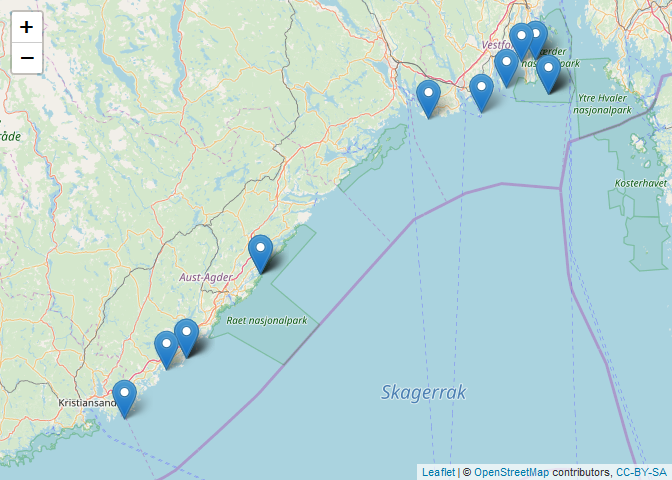
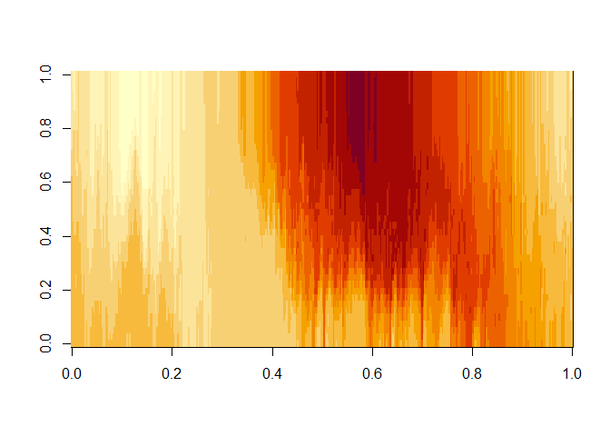
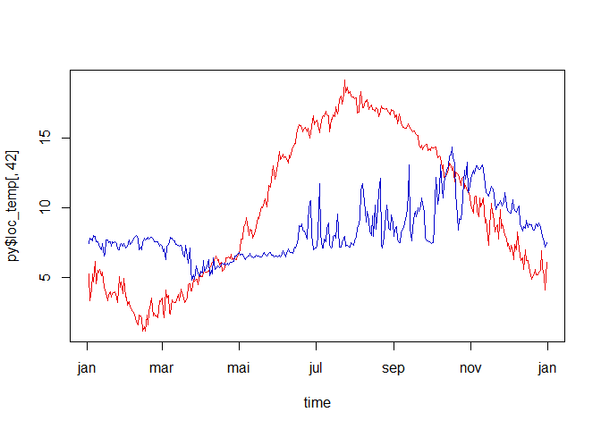
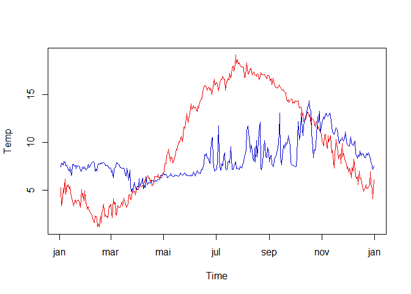
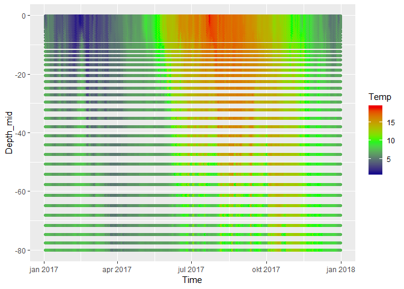
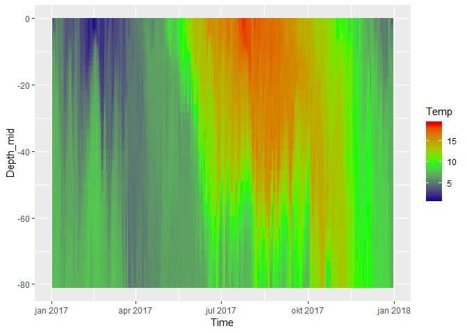
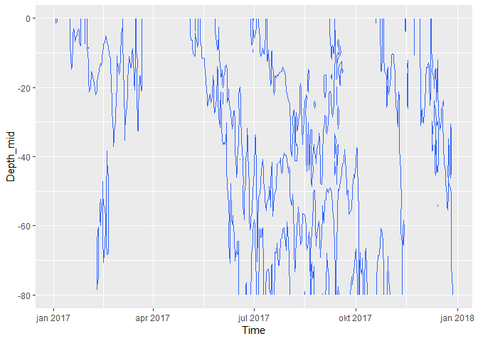
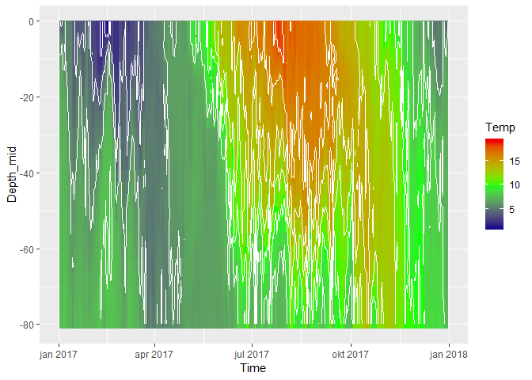
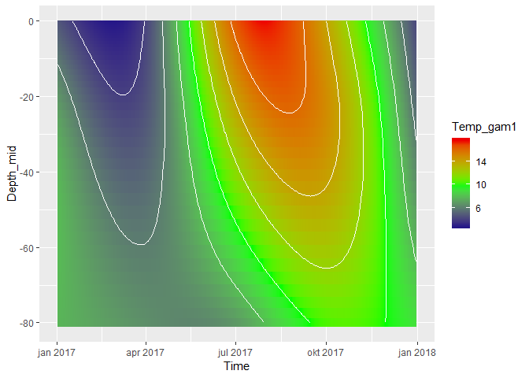
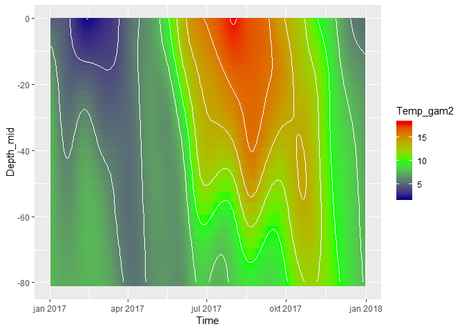

Read and plot depth profile data from thredds server
================
DHJ
23 9 2019

  - [Read and plot depth profile data from thredds
    server](#read-and-plot-depth-profile-data-from-thredds-server)
      - [1. R part](#r-part)
          - [a. Libraries](#a.-libraries)
          - [b. Get a location for which we want to extract
            data](#b.-get-a-location-for-which-we-want-to-extract-data)
          - [c. Plot stations in leaflet](#c.-plot-stations-in-leaflet)
          - [d. Select one location](#d.-select-one-location)
      - [2. Python part](#python-part)
          - [a. Connect to thredds
            server](#a.-connect-to-thredds-server)
          - [b. List all variables](#b.-list-all-variables)
          - [c. Get info on one variable](#c.-get-info-on-one-variable)
          - [d. Get all variables’ long
            names](#d.-get-all-variables-long-names)
          - [e. Access longitude, latitude and time and
            dimensions](#e.-access-longitude-latitude-and-time-and-dimensions)
          - [f. Explore dimensions](#f.-explore-dimensions)
          - [g. Find grid cell closest to our chosen station in
            R](#g.-find-grid-cell-closest-to-our-chosen-station-in-r)
          - [h. Depths of depth layers](#h.-depths-of-depth-layers)
          - [i. Getting values](#i.-getting-values)
      - [3. Bring data back to R](#bring-data-back-to-r)
          - [a. Test plots of the data from
            Python](#a.-test-plots-of-the-data-from-python)
          - [b. Checking conversion from matrix to
            vector](#b.-checking-conversion-from-matrix-to-vector)
          - [c. Convert data to ‘long
            format’](#c.-convert-data-to-long-format)
          - [d. Plot as discrete points](#d.-plot-as-discrete-points)
          - [e. Plot as tiles](#e.-plot-as-tiles)
          - [f. Plot as contours](#f.-plot-as-contours)
          - [g. Tiles + contours](#g.-tiles-contours)
          - [h. Tiles + contours, smoothed](#h.-tiles-contours-smoothed)

# Read and plot depth profile data from thredds server

## 1\. R part

### a. Libraries

``` r
library(reticulate)
use_python("C:/WinPython/WPy64-3720/python-3.7.2.amd64/python.exe")   # my Python installation

use_python("C:\\WinPython\\WPy64-3720\\python-3.7.2.amd64\\python.exe")

library(readxl)
library(ggplot2)
library(lubridate)
library(dplyr)
library(purrr)
```

### b. Get a location for which we want to extract data

  - Read hard-bottom data, `data_hardbottom`  
  - Then we extract location of the most used stations, `data_loc`
      - We use count() to get one line per station  
      - count() automatocally adds the variable n for sample size  
      - We then use n to get only stations with \>= 500 lines of data

<!-- end list -->

``` r
data_hardbottom <- read_excel("Test_data/data_hardbottom.xlsx")

data_stations <- data_hardbottom %>%
  count(STATION_CODE, STATION_NAME, LONGITUDE, LATITUDE) %>%
  filter(n > 500)

data_stations
```

    ## # A tibble: 17 x 5
    ##    STATION_CODE STATION_NAME LONGITUDE LATITUDE     n
    ##    <chr>        <chr>            <dbl>    <dbl> <int>
    ##  1 292          Kongshlm         10.5      59.1  1188
    ##  2 292          Kongsholmen      10.5      59.1  1188
    ##  3 293          Vakerholmen      10.4      59.1   612
    ##  4 302          Færder fyr       10.5      59.0  2200
    ##  5 303          Lyngholmene      10.3      59.0  1536
    ##  6 304          Oddaneskjær       9.86     59.0   954
    ##  7 305          O-skjæret        10.2      59.0   596
    ##  8 407          Tromøy            8.94     58.5  1574
    ##  9 407          Tromøy N.         8.94     58.5  1574
    ## 10 410          Presthlm          8.54     58.3  1706
    ## 11 410          Prestholmen       8.54     58.3  1706
    ## 12 411          Humleøy           8.43     58.2  1598
    ## 13 512          Meholmen          8.20     58.1  1544
    ## 14 A02          Færder fyr       10.5      59.0  2200
    ## 15 B07          Tromøy            8.94     58.5  1574
    ## 16 B10          Presthlm          8.54     58.3  1706
    ## 17 HT4          Færder fyr       10.5      59.0  2200

### c. Plot stations in leaflet

``` r
library(leaflet)

leaflet() %>%
  addTiles() %>%
  addMarkers(lng = data_stations$LONGITUDE, 
             lat = data_stations$LATITUDE,
             popup = paste(data_stations$STATION_CODE, data_stations$STATION_NAME))
```

<!-- -->

### d. Select one location

Færder fyr  
\* Note: this returns a one-row dat frame

``` r
selected_location <- data_stations %>%
  filter(STATION_CODE == "HT4")

selected_location
```

    ## # A tibble: 1 x 5
    ##   STATION_CODE STATION_NAME LONGITUDE LATITUDE     n
    ##   <chr>        <chr>            <dbl>    <dbl> <int>
    ## 1 HT4          Færder fyr        10.5     59.0  2200

## 2\. Python part

  - Python code is put inside code chunks marked ‘python’ instead of ‘R’
  - Note that you have to avoid Norwegian letters in the Python code,
    even in the comments - it causes errors (there is probably a way to
    fix this)

### a. Connect to thredds server

  - First, load the packages we need using `import` (similar to
    `library()` in R)  
  - Then we define a ‘pointer’ called `filehandle`) to the dataset  
  - We also create a `grid` object (named `grid`), which will be used in
    2h

<!-- end list -->

``` python
import numpy as np     # Package for scientific computing 
import pandas as pd    # Package for data frames 
import matplotlib.pyplot as plt   
from datetime import datetime,timedelta

from netCDF4 import Dataset #  This is handy for working with netCDF files

import cartopy.crs as ccrs
import cartopy.feature as cfeature

import roppy

filepath = 'http://thredds.met.no/thredds/dodsC/metusers/arildb/MARTINI800_prov_v2.ncml' # The OPENDAP URL

filehandle = Dataset(filepath) # open for reading 
grid = roppy.SGrid(filehandle) # Create a grid object for our file
```

### b. List all variables

Lots to choose
    from\!

``` python
print(filehandle.variables.keys())
```

    ## odict_keys(['ntimes', 'ndtfast', 'dt', 'dtfast', 'dstart', 'shuffle', 'deflate', 'deflate_level', 'nHIS', 'ndefHIS', 'nRST', 'ntsAVG', 'nAVG', 'ndefAVG', 'ntsDIA', 'nDIA', 'ndefDIA', 'nSTA', 'Falpha', 'Fbeta', 'Fgamma', 'nl_tnu2', 'nl_visc2', 'LuvSponge', 'LtracerSponge', 'Akt_bak', 'Akv_bak', 'Akk_bak', 'Akp_bak', 'rdrg', 'rdrg2', 'Zob', 'Zos', 'gls_p', 'gls_m', 'gls_n', 'gls_cmu0', 'gls_c1', 'gls_c2', 'gls_c3m', 'gls_c3p', 'gls_sigk', 'gls_sigp', 'gls_Kmin', 'gls_Pmin', 'Charnok_alpha', 'Zos_hsig_alpha', 'sz_alpha', 'CrgBan_cw', 'Znudg', 'M2nudg', 'M3nudg', 'Tnudg', 'Tnudg_SSS', 'FSobc_in', 'FSobc_out', 'M2obc_in', 'M2obc_out', 'Tobc_in', 'Tobc_out', 'M3obc_in', 'M3obc_out', 'rho0', 'gamma2', 'LuvSrc', 'LwSrc', 'LtracerSrc', 'LsshCLM', 'Lm2CLM', 'Lm3CLM', 'LtracerCLM', 'LnudgeM2CLM', 'LnudgeM3CLM', 'LnudgeTCLM', 'spherical', 'xl', 'el', 'Vtransform', 'Vstretching', 'theta_s', 'theta_b', 'Tcline', 'hc', 's_rho', 's_w', 'Cs_r', 'Cs_w', 'h', 'f', 'pm', 'pn', 'lon_rho', 'lat_rho', 'lon_u', 'lat_u', 'lon_v', 'lat_v', 'lon_psi', 'lat_psi', 'angle', 'mask_rho', 'mask_u', 'mask_v', 'mask_psi', 'ocean_time', 'zeta', 'ubar', 'vbar', 'u', 'v', 'w', 'omega', 'temp', 'salt', 'N1_p', 'N3_n', 'N4_n', 'N5_s', 'O2_o', 'O3_c', 'O3_TA', 'NR1_c', 'NR1_n', 'NR1_p', 'CR1_c', 'CR1_n', 'CR1_p', 'NR2_c', 'CR2_c', 'NR3_c', 'CR3_c', 'R4_c', 'R4_n', 'R4_p', 'R6_c', 'R6_n', 'R6_p', 'R6_s', 'R8_c', 'R8_n', 'R8_p', 'R8_s', 'P1_c', 'P1_n', 'P1_p', 'P1_Chl', 'P1_s', 'P2_c', 'P2_n', 'P2_p', 'P2_Chl', 'P3_c', 'P3_n', 'P3_p', 'P3_Chl', 'P4_c', 'P4_n', 'P4_p', 'P4_Chl', 'L2_c', 'P5_c', 'P5_n', 'P5_p', 'P5_Chl', 'P6_c', 'P6_n', 'P6_p', 'P6_Chl', 'B1_c', 'B1_n', 'B1_p', 'Z4_c', 'Z5_c', 'Z5_n', 'Z5_p', 'Z6_c', 'Z6_n', 'Z6_p', 'rho', 'AKv', 'AKs', 'shflux', 'ssflux', 'latent', 'sensible', 'lwrad', 'evaporation', 'rain', 'swrad', 'swradWm2', 'xCO2atm', 'pCO2atm', 'Q1_c', 'Q1_p', 'Q1_n', 'H1_c', 'ben_col_D1m', 'ben_col_D2m', 'H2_c', 'Y4_c', 'Y3_c', 'Y2_c', 'Q6_c', 'Q6_p', 'Q6_n', 'Q6_s', 'Q6_pen_depth_c', 'Q6_pen_depth_n', 'Q6_pen_depth_p', 'Q6_pen_depth_s', 'Q7_c', 'Q7_p', 'Q7_n', 'Q7_pen_depth_c', 'Q7_pen_depth_n', 'Q7_pen_depth_p', 'Q17_c', 'Q17_p', 'Q17_n', 'bL2_c', 'K1_p', 'ben_nit_G4n', 'K3_n', 'K4_n', 'K5_s', 'G2_o', 'G2_o_deep', 'G3_c'])

### c. Get info on one variable

``` python
filehandle.variables['P3_Chl']
```

    ## <class 'netCDF4._netCDF4.Variable'>
    ## float32 P3_Chl(ocean_time, s_rho, eta_rho, xi_rho)
    ##     long_name: picophytoplankton/chlorophyll a
    ##     units: mg/m^3
    ##     time: ocean_time
    ##     coordinates: lon_rho lat_rho s_rho ocean_time
    ##     field: P3_Chl, scalar, series
    ##     _FillValue: 1e+37
    ##     _ChunkSizes: [  1  14 142 160]
    ## unlimited dimensions: 
    ## current shape = (364, 42, 426, 480)
    ## filling off

### d. Get all variables’ long names

Note: commented out, as it generates a very long list

``` python
keys = filehandle.variables.keys()
print('Number of variables:', len(keys))
```

    ## Number of variables: 228

``` python
print()

#
# UNCOMMENT TO SEE THE WHOLE LIST
#
# for key in keys:
#   print(key, '=', filehandle.variables[key].long_name)
```

### e. Access longitude, latitude and time and dimensions

  - This doesn’t actually download the data, it just creates a ‘pointer’
    to them

<!-- end list -->

``` python
# Access to the longitude, latitude coordinates

lon = filehandle.variables['lon_rho']
lat = filehandle.variables['lat_rho']
ocean_time = filehandle.variables['ocean_time']
```

### f. Explore dimensions

``` python
# Let's see what the dimensions of this variable is by looping over the dimensions
print('Time dimensions:')
```

    ## Time dimensions:

``` python
for dimension in ocean_time.dimensions:
    # We'll print both dimension name, and the size of th dimension
    print('{}: {}'.format( dimension,  len(filehandle.dimensions[dimension] ) ) )

# And lets look at longitude as well:
```

    ## ocean_time: 364

``` python
print('\nLongitude (or latitude) dimensions:')   # \n is just "line shift"
```

    ## 
    ## Longitude (or latitude) dimensions:

``` python
for dimension in lon.dimensions:
    print( '{}: {}'.format( dimension,  len( filehandle.dimensions[dimension] ) ) )

# And finally let's look at one 'ordinary' variable:
```

    ## eta_rho: 426
    ## xi_rho: 480

``` python
print('\nDimensions of the temperature variable:')
```

    ## 
    ## Dimensions of the temperature variable:

``` python
temp = filehandle.variables['temp']
for dimension in temp.dimensions:
    print( '{}: {}'.format( dimension,  len( filehandle.dimensions[dimension] ) ) )
```

    ## ocean_time: 364
    ## s_rho: 42
    ## eta_rho: 426
    ## xi_rho: 480

### g. Find grid cell closest to our chosen station in R

  - Inside a Python chunk, we can access an R Object (values, vectors,
    dataframes) by putting `r.` in front of the objects name
      - E.g., we access R object `selected_location` by
        `r.selected_location`  
  - R data frames are converted to a Pandas DataFrame in Python  
  - In a Pandas DataFrame, you access a value by
    \[‘column\_name’\]\[row\_number\]  
  - Here we will access the R data frame `selected_location` (which has
    only one line)
  - We need to access longitude number 1 and latitude number 1 of this
    data frame - but be aware that Python starts counting at zero
  - So to get the first Longitude value, we write
      - R version 1: selected\_location\[1, ‘LONGITUDE’\] - OR  
      - R version 2: selected\_location$LONGITUDE\[1\]  
      - Python: r.selected\_location\[‘LONGITUDE’\]\[0\]

<!-- end list -->

``` python
# The decimal degree location of the selected station:
selected_lon = r.selected_location['LONGITUDE'][0]
selected_lat = r.selected_location['LATITUDE'][0]

# We need to find the grid location closest to the selected coordinates.
# For the sake of simplicity, let's calculate the sum of the absolute 
# differences between all grid points latitude and longitude and the 
# selected coordinates. 

position_diff = np.abs( lat[:] - selected_lat ) + np.abs( lon[:] - selected_lon )

# This line will find the indices of the minimum value in 
i, j = np.unravel_index( position_diff.argmin(), position_diff.shape )

print('Grid indices of grid point closest to selected location: {}, {}\n'.format(i, j))
```

    ## Grid indices of grid point closest to selected location: 209, 360

``` python
print('Grid point longitude: {}'.format(lon[i,j]))
```

    ## Grid point longitude: 10.523888043689027

``` python
print('Grid point latitude: {}'.format(lat[i,j]))
```

    ## Grid point latitude: 59.02317070046719

### h. Depths of depth layers

  - In the Norkyst 800 model, there are 42 depth layers from surface to
    the bottom, no matter how deep it is  
  - Therefore, the actual depth of each depth layer varies  
  - From the `grid` object created in 2a, we can get these depths  
  - Here, we print the depths at the select location given by i,j

<!-- end list -->

``` python

# What type of object is this number? Answer: 'numpy.ma.core.MaskedArray'
# x = grid.z_w[:,i,j]
# print(type(x))

print('Depth of each layer (m):\n')
```

    ## Depth of each layer (m):

``` python
Z = grid.z_w[: ,i,j]
print(np.round(Z, 2))
# print(np.round(Z, 2))
```

    ## [-81.07 -78.86 -76.2 -73.2 -69.95 -66.54 -63.04 -59.49 -55.96 -52.46
    ##  -49.03 -45.7 -42.48 -39.38 -36.41 -33.58 -30.89 -28.34 -25.94 -23.68
    ##  -21.56 -19.58 -17.73 -16.01 -14.41 -12.93 -11.56 -10.3 -9.14 -8.07 -7.09
    ##  -6.19 -5.37 -4.61 -3.92 -3.29 -2.71 -2.18 -1.69 -1.23 -0.8 -0.39 0.0]

``` python
print('\n\nThickness of each layer (m):\n')
```

    ## 
    ## 
    ## Thickness of each layer (m):

``` python
dZ = grid.z_w[1:, i,j] - grid.z_w[:-1, i, j]   # i.e., diffrence between one depth and the next
print(np.round(dZ, 2))
```

    ## [2.2 2.66 3.0 3.25 3.41 3.5 3.54 3.54 3.5 3.43 3.33 3.22 3.1 2.97 2.83
    ##  2.69 2.55 2.4 2.26 2.12 1.98 1.85 1.72 1.6 1.48 1.37 1.26 1.16 1.07 0.98
    ##  0.9 0.82 0.75 0.69 0.63 0.58 0.53 0.49 0.46 0.43 0.41 0.39]

``` python

for dimension in ocean_time.dimensions:
    # We'll print both dimension name, and the size of th dimension
    print()
    # print('{}: {}'.format( dimension,  len(filehandle.dimensions[dimension] ) ) )

# len(ocean_time.dimensions)
# ocean_time.dimensions
```

### i. Getting values

  - For real applications, we would like to download several or all
    depths  
  - But for demonstration purposes, we will just download the surface
    value  
  - As we saw in part 2f, there are 42 depth levels (‘s\_rho’)  
  - … and 2h showed that depths starts at the bottom, so the first depth
    (depth = 0) is the bottom and depth = 41 is the surface (remember,
    Python starts counting at zero\!)
  - Also, we pick every 30th day in order to get a quick
download

<!-- end list -->

``` python
# The dimensions are in (t,z,y,x) order and as indexi,g in Python starts from zero, 
# axis = 1 points to the z-dimension. 

# max of the time dimension
max_time = len(filehandle.dimensions["ocean_time"])

# Pick times (we choose all of them)
times = np.arange(0,max_time,1) 

# temp = potential temperaturen
# salt = salinity
# N1_p = phosphate/phosphorus
# N3_n = nitrate/nitrogen
# chla = chlorophyll A

loc_time = filehandle.variables['ocean_time'][times]
loc_temp = filehandle.variables['temp'][times,:,i,j]
```

``` python
len(loc_time)
```

    ## 364

``` python
loc_temp
```

    ## masked_array(
    ##   data=[[7.4391427, 7.4366856, 7.430236 , ..., 5.264018 , 5.260248 ,
    ##          5.256905 ],
    ##         [7.7818294, 7.780779 , 7.759962 , ..., 3.5443492, 3.3486793,
    ##          3.3240187],
    ##         [7.7547984, 7.706795 , 7.636909 , ..., 4.053964 , 4.0522723,
    ##          4.050565 ],
    ##         ...,
    ##         [7.545088 , 7.538158 , 7.50514  , ..., 5.1361594, 5.1253815,
    ##          5.1224895],
    ##         [7.1493735, 7.166576 , 7.202949 , ..., 4.087371 , 4.0817003,
    ##          4.077755 ],
    ##         [7.50954  , 7.5182247, 7.5415263, ..., 6.0796504, 6.077731 ,
    ##          6.075761 ]],
    ##   mask=False,
    ##   fill_value=1e+20,
    ##   dtype=float32)

## 3\. Bring data back to R

### a. Test plots of the data from Python

``` r
# Image plot of matrix (note: axes not given)
image(py$loc_temp)
```

<!-- -->

``` r
# Convert time to proper format
time <- as.POSIXct(py$loc_time, origin = "1970-01-01", tz = "UTC")

# Plot time series
plot(time, py$loc_temp[,42], type = "l", col = "red2")  # Top layer
lines(time, py$loc_temp[,1], col = "blue3")             # Bottom layer
```

<!-- -->

### b. Checking conversion from matrix to vector

``` r
cat("Dimensions:\n")
```

    ## Dimensions:

``` r
dim(py$loc_temp)
```

    ## [1] 364  42

``` r
cat("\nMatrix (part of it):\n")
```

    ## 
    ## Matrix (part of it):

``` r
test <- py$loc_temp[1:5, 1:3]
test
```

    ##          [,1]     [,2]     [,3]
    ## [1,] 7.439143 7.436686 7.430236
    ## [2,] 7.781829 7.780779 7.759962
    ## [3,] 7.754798 7.706795 7.636909
    ## [4,] 7.629156 7.600989 7.499976
    ## [5,] 7.964162 7.904899 7.824732

``` r
cat("\nMatrix as vector - first 5 entries is column 1, row 1-5 (i.e. depth 1, time 1-5):\n")
```

    ## 
    ## Matrix as vector - first 5 entries is column 1, row 1-5 (i.e. depth 1, time 1-5):

``` r
as.numeric(test)
```

    ##  [1] 7.439143 7.781829 7.754798 7.629156 7.964162 7.436686 7.780779
    ##  [8] 7.706795 7.600989 7.904899 7.430236 7.759962 7.636909 7.499976
    ## [15] 7.824732

### c. Convert data to ‘long format’

``` r
# py$Z = limits of depth layers, from bottom to top (see 2h)
#   I.e., the first two values of py$Z = the bottom and top limits of the bottom layer
# depth_mid = middle depth of each layer (midway between the bottom and top limits)
depth_lo <- head(py$Z,-1)              # all values except the last
depth_hi <- tail(py$Z,-1)              # all values except the first
depth_mid <- (depth_lo + depth_hi)/2   # mid depth

# Make data frame
loc_data <- data.frame(
  Time = time,                                       # time has length 364, but will just repeat itself
  Depth_lo = rep(depth_lo, each = length(time)),     # value no. 1 is repeteated 364 times, etc.
  Depth_hi = rep(depth_hi, each = length(time)),     # value no. 1 is repeteated 364 times, etc.
  Depth_mid = rep(depth_mid, each = length(time)),   # value no. 1 is repeteated 364 times, etc.
  Temp = as.numeric(py$loc_temp)                     # transforming matrix to vector
  )

# Plot time series based on data frame  (same plot as in a)
plot(Temp ~ Time, data = subset(loc_data, Depth_mid == depth_mid[42]), type = "l", col = "red2")  # Top layer
lines(Temp ~ Time, data = subset(loc_data, Depth_mid == depth_mid[1]), col = "blue3")             # Bottom layer
```

<!-- -->

### d. Plot as discrete points

``` r
ggplot(loc_data, aes(x = Time, y = Depth_mid, color = Temp)) +
  geom_point() +
  scale_color_gradient2(low = "blue4", mid = "green", high = "red2", midpoint = 10)
```

<!-- -->

### e. Plot as tiles

Use ‘height’ to set the height of each tile,
oth

``` r
ggplot(loc_data, aes(x = Time, y = Depth_mid, fill = Temp, height = Depth_hi- Depth_lo)) +
  geom_tile() +
  scale_fill_gradient2(low = "blue4", mid = "green", high = "red2", midpoint = 10)
```

<!-- -->

### f. Plot as contours

``` r
ggplot(loc_data, aes(x = Time, y = Depth_mid, z = Temp)) +
  geom_contour(binwidth = 4)
```

<!-- -->

### g. Tiles + contours

``` r
ggplot(loc_data, aes(x = Time, y = Depth_mid, fill = Temp, height = Depth_hi- Depth_lo)) +
  geom_tile() +
  scale_fill_gradient2(low = "blue4", mid = "green", high = "red2", midpoint = 10) +
  geom_contour(aes(z = Temp), binwidth = 2, color = "white")
```

<!-- -->

### h. Tiles + contours, smoothed

Here, using GAM with tensor product smooth (te)

``` r
library(mgcv)
```

    ## Loading required package: nlme

    ## 
    ## Attaching package: 'nlme'

    ## The following object is masked from 'package:dplyr':
    ## 
    ##     collapse

    ## This is mgcv 1.8-28. For overview type 'help("mgcv-package")'.

``` r
pred1 <- gam(Temp ~ te(as.numeric(Time), Depth_mid), data = loc_data) %>% predict()
pred2 <- gam(Temp ~ te(as.numeric(Time), Depth_mid, k = 20), data = loc_data) %>% predict()

loc_data$Temp_gam1 = pred1
loc_data$Temp_gam2 = pred2

ggplot(loc_data, aes(x = Time, y = Depth_mid, fill = Temp_gam1, height = Depth_hi- Depth_lo)) +
  geom_tile() +
  scale_fill_gradient2(low = "blue4", mid = "green", high = "red2", midpoint = 10) +
  geom_contour(aes(z = Temp_gam1), binwidth = 2, color = "white")
```

<!-- -->

``` r
ggplot(loc_data, aes(x = Time, y = Depth_mid, fill = Temp_gam2, height = Depth_hi- Depth_lo)) +
  geom_tile() +
  scale_fill_gradient2(low = "blue4", mid = "green", high = "red2", midpoint = 10) +
  geom_contour(aes(z = Temp_gam2), binwidth = 2, color = "white")
```

<!-- -->
