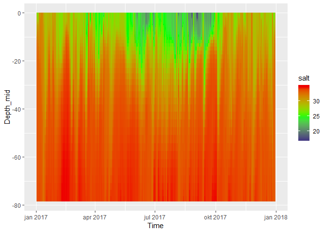

# Read and plot depth profile data from thredds server  

What we will do here, is to  
1. List variables (in order to find the variable names we need for step 2)   
2. Get all temperature and salinity data from given coordinates  
3. Plot those data (as profile plots and T-S plots)    

## 0. Load libraries and functions  

```r
library(reticulate)
use_python("C:/WinPython/WPy64-3720/python-3.7.2.amd64/python.exe")   # my Python installation
library(ggplot2)
library(lubridate)
library(dplyr)
library(purrr)
library(mgcv)

# Functions Specifically for this 
source("34_Profile_data_R_functions.R")
source_python("34_Profile_data_Python_functions.py")
```


## 2. Get variable information   
* Use this function to find out which variables you can download - you must use the name given in the first column (e.g. 'salt'  for salinity)   
* This includes modelled biological variables (e.g. plankton density) and chemical ones (e.g. nitrate, phosphate)  
* 'variable_info()' is in fact a Python function (loaded by 'source_python' above), but can be used by R as it was an ordinary R function!   

```r
variables <- variable_info()

# Will only show up in an interactive session:
View(variables)
```

## 3. Get data for two variables at a given position (logitude, latitude)   
* In this example 
    - location is the coordinates of Færder hard-bottom station   
    - variables we ask for is temperature and salinity. Choose names from list above (section 2)
* When we don't specify server_url, it uses the default ('http://thredds.met.no/thredds/dodsC/metusers/arildb/MARTINI800_prov_v2.ncml')
* May take a minute or two    

```r
df <- read_profile(10.5268, 59.0267, c('temp','salt'))

# The next two lines does the same thing (read_profile just combines those two):
# (May be useful for debugging in case of errors)
#   X <- read_profile_list(10.5268, 59.0267, c('temp','salt'))  # returns list
#   df <- profile_list2dataframe(X)                             # returns data.frame
```

## 3. Test plots  

### a. Profile plots  
May also smooth the surface before plotting - see script 33  

```r
ggplot(df, aes(x = Time, y = Depth_mid, fill = temp, height = Depth_hi- Depth_lo)) +
  geom_tile() +
  scale_fill_gradient2(low = "blue4", mid = "green", high = "red2", midpoint = 10)
```

<!-- -->

```r
ggplot(df, aes(x = Time, y = Depth_mid, fill = salt, height = Depth_hi- Depth_lo)) +
  geom_tile() +
  scale_fill_gradient2(low = "blue4", mid = "green", high = "red2", midpoint = 25)
```

<!-- -->

### b. Tiles + contours, smoothed   
Here, using GAM with tensor product smooth (te) which is a bit slow   

```r
library(mgcv)

# Perform GAM and compute the predicted values from the GAM model
pred <- gam(temp ~ te(as.numeric(Time), Depth_mid, k = 20), data = df) %>% predict()

# Add predicted values
df$temp_gam = pred

# Plot predicted values, including contour lines
ggplot(df, aes(x = Time, y = Depth_mid, fill = temp_gam, height = Depth_hi- Depth_lo)) +
  geom_tile() +
  scale_fill_gradient2(low = "blue4", mid = "green", high = "red2", midpoint = 10) +
  geom_contour(aes(z = temp_gam), binwidth = 2, color = "white")
```

<!-- -->

### c. T-S plot (temperatur vs. salinity) version 1 

```r
df <- df %>%
  mutate(Depth_binned = cut(Depth_mid, breaks = -c(0,10,20,40,90)))

ggplot(df, aes(x = salt, y = temp)) +
  geom_point(size = rel(0.5)) +
  facet_grid(rows = vars(Depth_binned), cols = vars(month(Time)))
```

<!-- -->

### d. T-S plot (temperatur vs. salinity) version 2  

```r
df <- df %>%
  mutate(Month_binned = cut(month(Time), breaks = c(0,3,6,9,12), 
                            labels = c("Jan-Mar", "Apr-Jun", "Jul-Sep", "Oct-Dec"))
         )

# Just to check:
# df %>% count(month(Time), Month_binned)

ggplot(df, aes(x = salt, y = temp, col = Depth_mid)) +
  geom_point(size = rel(0.5)) +
  facet_wrap(vars(Month_binned))
```

<!-- -->
