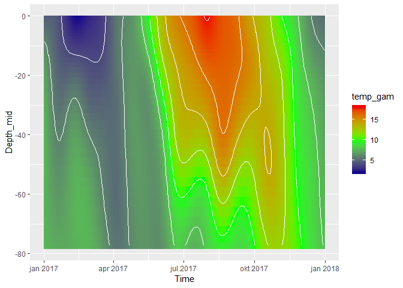

# Martini
**Codes for the Martini project.**  
Mostly in R, but some call Python (using reticulate in RStudio)

## Scripts (some of them...)

### [01_Add_2017_data.R](01_Add_2017_data.R)  
Adding 2017 data (from Vannmiljø, long format) to Phil's data 2000-2016 (wide format)  
Also: the Vannmiljø nutrient data are in weight per L, Phil's data are in micromol per L  

### [02_Check_SiO_data.R](02_Check_SiO_data.R)  
Checking which units that have been used for silicate data in Arendal st. 2  

### [34 Profile data function.Rmd](34%20Profile%20data%20function.Rmd)  
A script which allows the user to download data from the met.no thredds server in a simple way. E.g., for downloading profile data (a depth x time matrix for e.g. temperature) for one or several positions/stations. Example from script:    
  